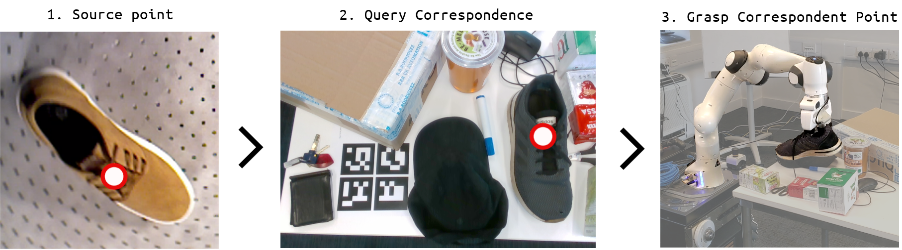
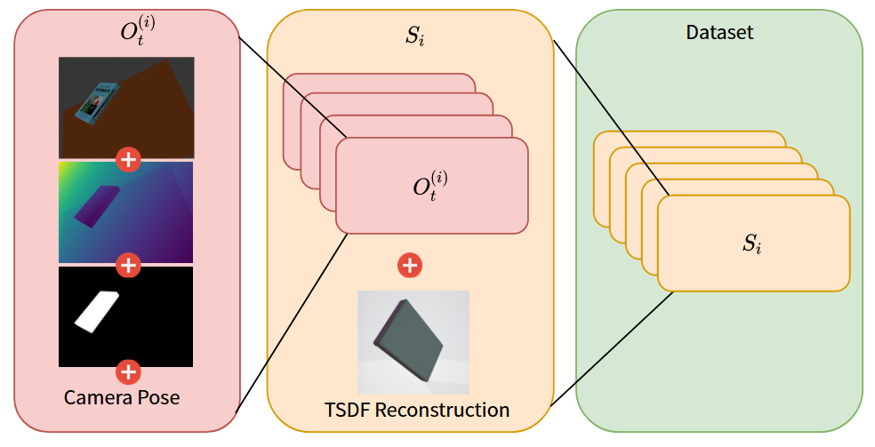
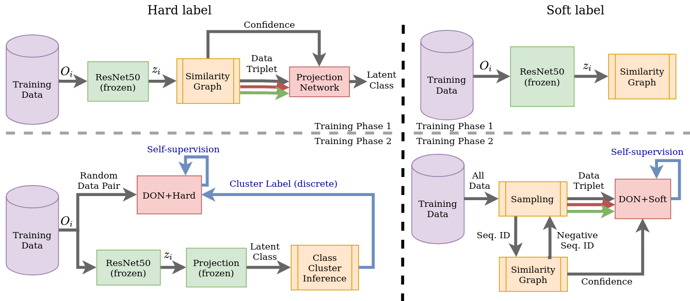
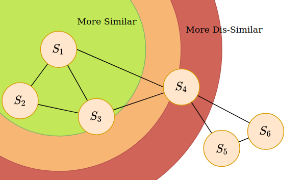
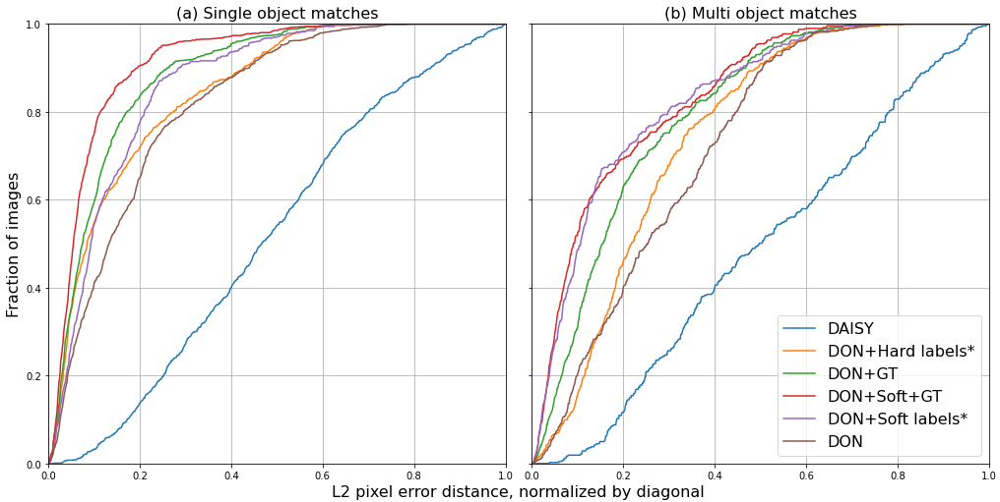
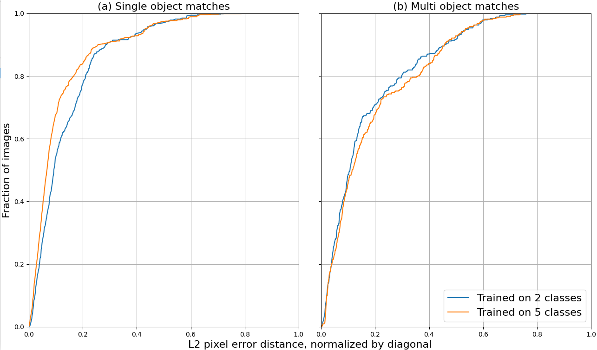
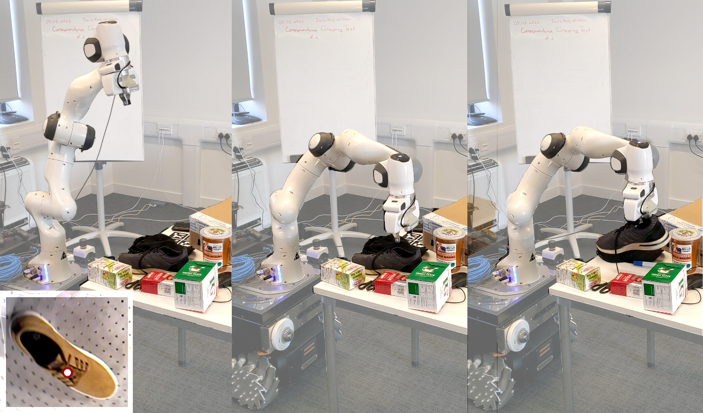

# Fully Self-Supervised Class Awareness in Dense Object Descriptors

We address the problem of inferring self-supervised dense semantic correspondences between objects in **multi-object** scenes. The method introduces learning of class-aware dense object descriptors by providing either unsupervised discrete labels or confidence in object similarities. We quantitatively and qualitatively show that the introduced method outperforms previous techniques with more robust pixel-to-pixel matches. An example robotic application is also shown - grasping of objects in clutter based on corresponding points.We address the problem of inferring self-supervised dense semantic correspondences between objects in multi-object scenes. The method introduces learning of class-aware dense object descriptors by providing either unsupervised discrete labels or confidence in object similarities. We quantitatively and qualitatively show that the introduced method outperforms previous techniques with more robust pixel-to-pixel matches. An example robotic application is also shown - grasping of objects in clutter based on corresponding points.

## Background 

### Dense Object Nets
Dense Object Nets[1](#f1) (DONs) are the foundation of our method. They learn a dense descriptor representation of RGB inputs that is applicable to both rigid and non-rigid objects using the strong prior of depth information and knowledge of a robot manipulator's pose. This is done by projecting 2D image pixels onto a reconstructed 3D model, thus learning correspondences between different views of the same 3D points. Multiple views are captured by a robot with a mounted camera. In Siamese fashion, the model is fed pairs of augmented images from which pixels are randomly sampled. Augmentations consist of random background,  color jitter, crops, and scale. Pixels corresponding to the same 3D point are considered matches while any other random pair of pixels are considered non-matches. 

The model uses a match- and non-match- loss to guide the representations toward a desirable solution in a self-supervised manner. The loss is the sum of match and non-match losses defined as follows:

$$
	L_{match} = 
    \cfrac{1}{N_{+}}
    \sum_{N_{+}} || d_a - d_b ||^2_2
$$
$$
L_{non-match} = 
    \cfrac{1}{N_{m}}
    \sum_{N_{-}} 
    \max(0, M - 
    || d_a - d_b ||_2 )^2
$$

where $d_a$ and $d_b$ are the output descriptors at the given pixel pair and $N_{+}$ is the total number of match pairs. Similarly, $N_{-}$ is the total number of non-matches. $M$ is a margin hyperparameter determining the minimum distance between non-match pairs - if a non-match pair is closer than $M$, the loss is increased. $N_m$ is the number of these matches that is below the margin. 

While $L_{match}$ encourages true pairs to be similar, $L_{non-match}$ ensures the pixels don't all converge to the same descriptor. **Since the robot has no knowledge of the object's class, the learned descriptors tend to share the same descriptor space for all objects**. 

## Method

### Data Organization

The inputs used for training are a set of $n$ sequences $S=\{S_1, S_2, ..., S_n\}$, where each sequence contains timed data for a single object $S_i=\{O^{(i)}_1,O^{(i)}_2,...,O^{(i)}_t\}$. The data $O^{(i)}_t$ for timepoint~$t$ and object~$(i)$, consists of a camera pose, full RGB and Depth image and object mask. A 3D TSDF reconstruction is also generated for the whole sequence. See below:

### Class-Aware Dense Object Nets

To disentangle the descriptor subsets used by different objects, most straightforward is to find non-match pairs between them and learn to repel them. We considered two variants: (i) __DON+Hard__ producing discrete `hard` labels by assigning each instance to a cluster or (ii) __DON+Soft__ using similarity-based triplet sampling and continuous `soft` confidence scores. Both variants use the same DON model for dense correspondence, and similarity graph for object disentanglement, differing mainly in data flow, sampling and loss generation, as shown below:

### Similarity Graph

Since we assume access object sequences but not their class labels, the method requires a way of understanding each object's identity or class grouping in a different way. Here we propose object disentanglement based on a recent work[2](#f2) which consists of a similarity graph (SG) and random walker sampling (RWS). SG is an undirected graph with each node representing a training sequence and each edge the similarity between the node pair. Thus, given any node in the SG, we can find which other nodes are most probably similar to it. RWS is the sampling of node pairs by ``walking'' on edges with transitional probability proportional to the edge weights. 

The similarity graph is undirected, with each training sequence representing a node $S_i$. The edges between each pair of nodes is determined by \textit{similarity weights} $W(S_i,S_j)$ which are calculated using a similarity and dissimilarity measure, $W^+$ and $W^-$, respectively. The similarity between nodes is shown abstractly in the following figure:

For more information on this method, check the reference[2](#f2).

### Hard Classification

For \emph{DON+Hard} the triplets (anchor $A$, positive $P$, and negative $N$) of sample frames are generated using the similarity graph and fed into a projection network comprised of two fully connected layers with ReLU activations. The projection network is trained via triplet loss scaled by our confidence $c$ and margin $M$. The loss is made non-negative as shown:

$$
    L = ReLU\left(
    {||A-P||_2}
    -
    {||A-N||_2}
    +
    c.M
    \right)
$$

The resulting projection output is a continuous latent class representation. Finally, the representations of the training data are grouped into $K$ clusters, determining the discrete classes. In inference time, assuming the input belongs to one of the existing classes, it can be projected and matched to the closest cluster. We denote this as training phase one. In the second phase, the DON iteratively accepts two kinds of image pairs as inputs with equal probability: (i) same sequence pairs that consist of two different frames of the same object from the same sequence and (ii) different sequence pairs that consist of two frames from random different sequences. In the different sequence scenario, the objects' discrete classes are inferred by assigning them to one of the $K$ clusters - if their classes are the same, the pair is ignored, otherwise - non-match pixel pairs are generated and used for DON loss. In the same sequence, both match and non-match pairs are generated.

### Soft Classification

For the DON+Soft variant, the similarity graph is generated with all available sequences (training phase one). A random sequence is sampled and a negative sequence pairing is randomly chosen based on the transition probabilities of the similarity graph. Two frame samples are taken from the initial sequence (anchor $A$ and positive $P$) and one from the negative sequence, $N$, forming a triplet. The triplet is passed through the DON. Only non-matches are generated for the negative pair. A combination of the DON pixelwise match and non-match losses is used. The negative pair does not have any matches, instead its $L_{non-match}$ is scaled by the confidence $c$ in the negative pairing, thus if there is strong belief that the pair is from the same class, the loss is smaller. The total loss is defined as follows:

$$    
    L = 
    L_{pos, non-match} 
    + 
    L_{pos, match}
    + 
    c.L_{neg, non-match}
$$

## Experiments

In the main experiment, a set of images is annotated manually with pixel locations of key semantic object parts (e.g. shoe tip, hat top). The ability of the models to find correspondences between these keypoints is evaluated with the error distance between the ground truth- and found- correspondences. Our results demonstrate the superior ability of DON+Soft in multi-object scenarios in comparison with baseline methods.  

Another question is whether the soft model (DON+Soft) can effectively scale to higher numbers of classes. To test this, we compared the results of the same evaluation before and after training with additional classes.

Finally, we show the applicability of our method in a real world setting - grasping of semantic correspondences in cluttered scenes. All 50 attempted grasps except for one, where the correspondence was found at the edge of the object, were successful.

## Discussion

The method has removed a significant limitation of previous works, however it still has much to improve: (i) For continual learning to be applied, the training has to be able to work with cluttered images as well; (ii) Only static scenes have been used in both this and the previous work; (iii) Rejection of correspondences is needed when the actual correspondence is occluded and thus not found. Alternatively, a future method could propose where this occluded point most likely is.

## References

<b id="f1">\[1\]</b> Peter Florence\*, Lucas Manuelli\*, Russ Tedrake. "Dense Object Nets: Learning Dense Visual Object Descriptors By and For Robotic Manipulation." Conference on Robot Learning (CoRL), 2018 [↩](#a1)

<b id="f2">\[2\]</b> Juntao Tan, Changkyu Song, Abdeslam Boularias. "A Self-supervised Learning System for Object Detection in Videos Using Random Walks on Graphs". International Conference on Robotics and Automation (ICRA). 2021 [↩](#a2)
